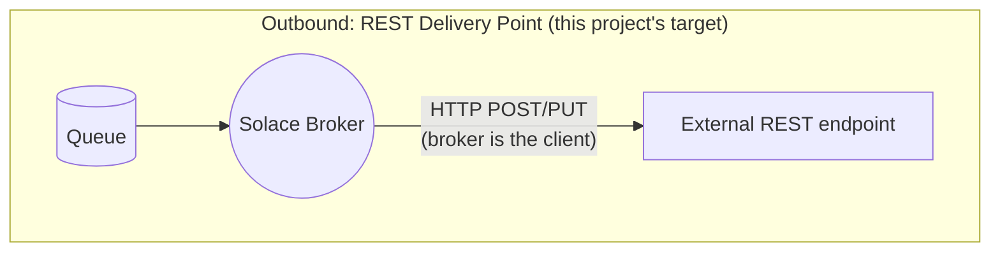

# Solace → Ballerina delivery bridge

[](LICENSE)

A more resilient, open-source alternative to Solace's **REST Delivery Point (RDP)** (a
Ballerina service that subscribes to a Solace queue and delivers to REST endpoints with circuit
breaking, retry/backoff, response-aware ack/nack, payload transformation, and Basic/OAuth2 auth,
all of it config-driven): the resilience RDP was never built to offer.

RDP is genuinely great for the simple case: point a queue at a URL, zero code, messages flow.
The moment you need more than that (a target that goes down, a payload that needs reshaping, a
target behind real auth), RDP has nowhere to go, because it's a fixed broker feature, not a
program. This bridge is what "more" looks like, packaged as one container you drop in next to
your broker.

## The problem, briefly

- **No circuit breaker**: a failing target gets hammered at a fixed rate forever, no backoff.
- **Responses are mostly ignored**: coarse success/exhausted-retries, no branching on status.
- **Thin error logging**: root-causing a downstream HTTP failure from broker logs alone is
  painful.
- **No payload shaping**: whatever's on the queue is what goes over the wire, verbatim.
- **Limited auth**: whatever RDP's own REST target config happens to support.

Full case, and the comparison table: [`docs/problem-and-solution.md`](docs/problem-and-solution.md).

## What's built

- Response-aware ack/nack: `ack` on 2xx, `nack(requeue=false)` to a dead message queue on a
  permanent 4xx, `nack(requeue=true)` for redelivery on a transient failure.
- Retry with backoff and a circuit breaker per target, so a struggling downstream gets protected
  instead of pile-on.
- Structured logs: root-cause a failed delivery from the bridge's own logs alone.
- Payload transformation: field/header mapping and enrichment, not pass-through.
- Prometheus-style metrics.
- HTTP Basic and OAuth2 client-credentials auth, including transparent token refresh.

Every one of these is a working, runnable sample under [`samples/`](samples/): the scenario, the
comparison to RDP, diagrams, and exact setup/test steps.

## How it fits



This bridge is a drop-in alternative to the outbound (RDP) side, not to REST messaging, and not
a general-purpose iPaaS. It's a focused, single-purpose, open-source component: closer in spirit
to a well-written microservice than to a platform, on purpose. Full architecture, including
sequence diagrams for the delivery flow: [`docs/architecture.md`](docs/architecture.md).

## Quick start

```bash
git clone https://github.com/seyyatech/solace-rdp-plus.git
cd solace-rdp-plus/samples/resilient-delivery
docker compose up -d --build
./init/setup.sh
```

Then flip the mock target unhealthy and watch a real RDP hammer it forever while the bridge's
circuit breaker trips, fast-fails, and later recovers cleanly on its own; the actual side-by-side
proof, not a claim:

```bash
curl -X POST -H "Content-Type: application/json" -d '{"statusCode": 503}' http://localhost:8081/control
docker compose logs -f bridge mock-target
```

See [`samples/resilient-delivery/README.md`](samples/resilient-delivery/README.md) for the full
walkthrough, and [`samples/`](samples/) for every other scenario.

## Docs

- [`docs/problem-and-solution.md`](docs/problem-and-solution.md): the case against RDP, the
  full comparison, and the scenario list.
- [`docs/architecture.md`](docs/architecture.md): how the bridge is put together, with
  sequence diagrams.
- [`bridge/README.md`](bridge/README.md): the bridge itself, capabilities and configuration.
- [`samples/`](samples/): one self-contained, runnable sample per capability.
- [`docs/solace-rdp-primer.md`](docs/solace-rdp-primer.md): new to Solace's RDP object model?
  Start here.

## License

[Apache 2.0](LICENSE).
