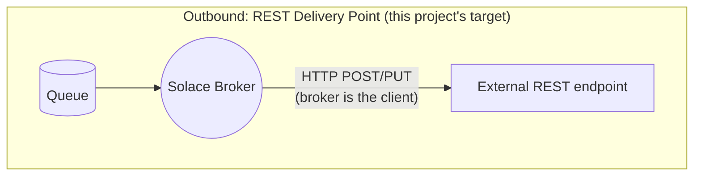

# RDP Bridge

[](LICENSE)

An open-source companion to Solace's **REST Delivery Point (RDP)** (a Ballerina service that
subscribes to a Solace queue and delivers to REST endpoints with circuit breaking, retry/backoff,
response-aware ack/nack, and payload transformation, all of it config-driven), for delivery
scenarios that need application-level logic: decision-making that belongs in code, not broker
configuration.

RDP is genuinely great for the simple case: point a queue at a URL, zero code, messages flow.
The moment you need more than that (a target that fails intermittently and needs backoff plus a
circuit breaker, a payload that needs reshaping, custom logic tied to your own auth flow), that
logic belongs in an application. This bridge is what "more" looks like, packaged as one container
you drop in next to your broker.

## The problem, briefly

- **No circuit breaker**: RDP retries at a fixed interval indefinitely by default (bounded only
  if you configure `max-redelivery`/`max-ttl` yourself), with no backoff and no way to trip and
  stop calling a persistently failing target.
- **Response handling is broker-level**: since broker version 10.12, specific status codes can be
  marked as rejections (skip retry, straight to the dead message queue), but there's still no
  branching on response *content* as testable, versionable code.
- **Logs are broker-level**: per-message delivery tracing lives in application code, not in the
  broker's own logs.
- **No body reshaping**: RDP's substitution expressions can set headers or a request target from
  topic/system values, but the message body itself is delivered verbatim.

Full case, and the comparison table: [`docs/problem-and-solution.md`](docs/problem-and-solution.md).

## What's built

- Response-aware ack/nack: `ack` on 2xx, `nack(requeue=false)` to a dead message queue on a
  permanent 4xx, `nack(requeue=true)` for redelivery on a transient failure.
- Retry with backoff and a circuit breaker per target, so a struggling downstream gets protected
  instead of pile-on.
- Structured logs: root-cause a failed delivery from the bridge's own logs alone.
- Payload transformation: field/header mapping and enrichment, not pass-through.
- Prometheus-style metrics.
- HTTP Basic and OAuth2 client-credentials auth, including transparent token refresh.

Every one of these is a working, runnable sample under [`samples/`](samples/): the scenario, the
comparison to RDP, diagrams, and exact setup/test steps.

## How it fits



This bridge is a drop-in alternative to the outbound (RDP) side, not to REST messaging, and not
a general-purpose iPaaS. It's a focused, single-purpose, open-source component: closer in spirit
to a well-written microservice than to a platform, on purpose. Full architecture, including
sequence diagrams for the delivery flow: [`docs/architecture.md`](docs/architecture.md).

## Quick start

```bash
git clone https://github.com/seyyatech/solace-rdp-bridge.git
cd solace-rdp-bridge/samples/resilient-delivery
docker compose up -d --build
./init/setup.sh
```

Then flip the mock target unhealthy and watch a real RDP retry it at a fixed rate with no backoff
while the bridge's circuit breaker trips, fast-fails, and later recovers cleanly on its own; see
the difference side by side:

```bash
curl -X POST -H "Content-Type: application/json" -d '{"statusCode": 503}' http://localhost:8081/control
docker compose logs -f bridge mock-target
```

See [`samples/resilient-delivery/README.md`](samples/resilient-delivery/README.md) for the full
walkthrough, and [`samples/`](samples/) for every other scenario.

## Docs

- [`docs/problem-and-solution.md`](docs/problem-and-solution.md): when to reach beyond RDP, the
  full comparison, and the scenario list.
- [`docs/architecture.md`](docs/architecture.md): how the bridge is put together, with
  sequence diagrams.
- [`bridge/README.md`](bridge/README.md): the bridge itself, capabilities and configuration.
- [`samples/`](samples/): one self-contained, runnable sample per capability.
- [`docs/solace-rdp-primer.md`](docs/solace-rdp-primer.md): new to Solace's RDP object model?
  Start here.

## License

[Apache 2.0](LICENSE).
