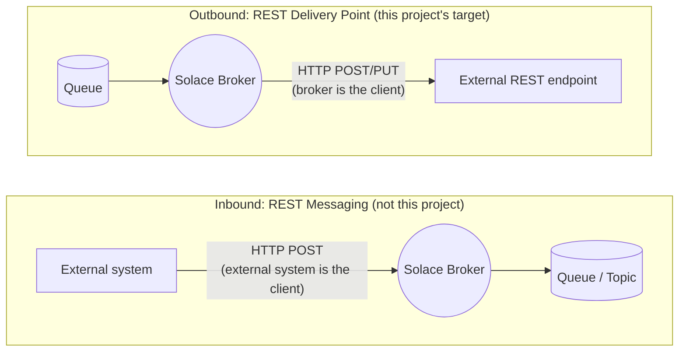
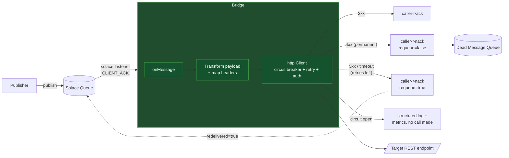
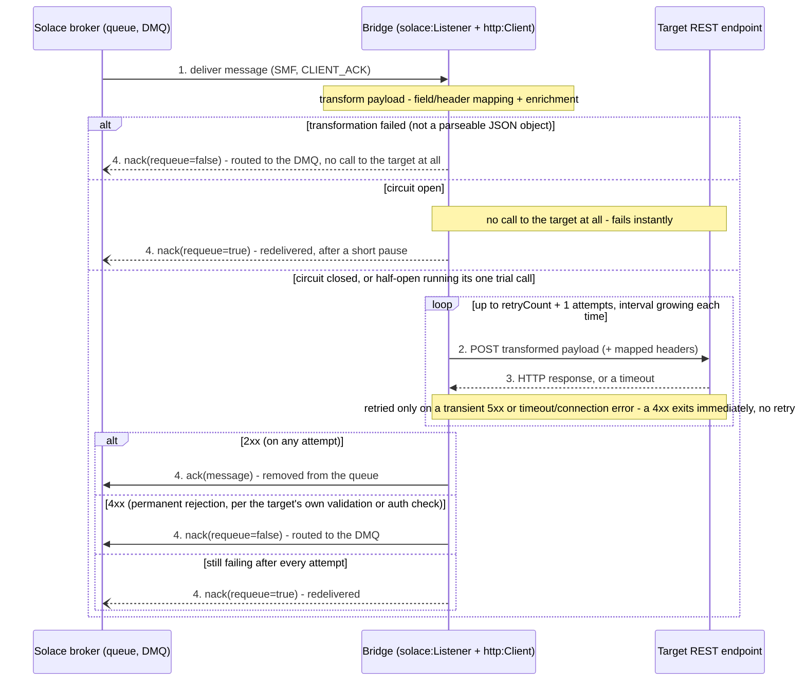

# Architecture

## Where this sits, relative to Solace

"Outbound" and "inbound" here are relative to the **Solace broker**, not to any particular
application:

- **Outbound (REST Delivery Point, what this project replaces)**: the broker itself *initiates*
  an HTTP request. A message lands on a queue, and an RDP pushes it *out* to an external REST
  endpoint via POST/PUT. The broker is the HTTP client; the target system is the HTTP server.
  This bridge sits in this same slot, a drop-in alternative to an RDP, not to REST messaging.
- **Inbound (REST messaging, a separate Solace feature, not what this project touches)**: the
  mirror image. An external system POSTs a message *to* the broker over HTTP, and the broker
  turns that into a queue/topic message for downstream consumers.

## Component overview

The bridge is a real client of the queue (`solace:Listener` in `CLIENT_ACK` mode), not a broker
feature; it consumes the queue over SMF (Solace Message Format) the same way any Solace
application would. The key structural difference from an RDP: **the response drives the
decision**, and that decision is expressed back to the broker via ack/nack, not just "delivered
or not."

## Delivery sequence

Left to right above is broker, bridge, target; every solid arrow is a real network hop, numbered
in the order it happens:

1. **Broker → bridge**: the queue delivers the message over SMF. The bridge transforms the
   payload immediately after (no network hop). A payload that fails to parse here nacks straight
   to the DMQ; nothing else below happens for that message.
2. **Bridge → target**: the bridge POSTs the *transformed* payload, with the mapped headers,
   possibly more than once, and only if the circuit is closed (or half-open and due its one
   trial). Steps 2–3 repeat inside the `http:Client`'s own retry loop entirely before the bridge's
   own code sees anything; it has no visibility into individual attempts, only the final outcome.
3. **Target → bridge**: the HTTP response comes back (dashed: a reply, not a new request), or
   the attempt times out; this decides whether the loop retries again or exits: a retryable
   status/timeout with attempts remaining loops back to step 2 after the current interval;
   anything else (success, a 4xx, or attempts exhausted) exits, and feeds the *outer*
   circuit-breaker outcome too (a final failure counts against the target's health; a 4xx
   doesn't).
4. **Bridge → broker**, depending on the outcome:
   - **2xx** (on any attempt) → `ack`: message is done, removed from the queue.
   - **4xx** (a transformation failure at step 1, or a bad/unprocessable payload or an auth
     failure per the target, never enters the retry loop either way) → `nack(requeue=false)`:
     routed straight to the DMQ instead of being retried forever.
   - **Still failing after every attempt, or the circuit was already open** → `nack(requeue=true)`
     (dotted, loops back rather than ending): the broker redelivers it. Once enough of these
     accumulate, the circuit trips: further deliveries skip straight to this branch with no call
     to the target at all, protecting it from exactly the kind of hammering an RDP does. It
     doesn't stop the broker's own (backoff-less) redelivery loop, though; the bridge adds its
     own small pause here too, or the loop just moves from hammering the target to hammering the
     broker instead.

Every log line at every step above carries the message ID, target, and whether the message was
redelivered; see [`bridge/README.md`](../bridge/README.md) for how to read these logs (and enable
the matching Prometheus metrics), and [`samples/resilient-delivery`](../samples/resilient-delivery/)
for this whole sequence, including the circuit tripping and recovering, run against a real broker.

## Deployment shape

Each sample under `samples/` is a fully self-contained `docker-compose.yaml`: a real Solace
broker, this same `bridge` image (built from the shared [`../bridge`](../bridge/) folder, one
codebase, configured differently per sample), and a small, purpose-built mock target written in
Ballerina. Nothing in a sample reaches outside its own folder except that shared `bridge/`
build context, so each one can be read, run, and understood on its own.

New to Solace's RDP object model (Queue, REST Delivery Point, REST Consumer, Queue Binding)? See
[`solace-rdp-primer.md`](solace-rdp-primer.md) for a primer.
