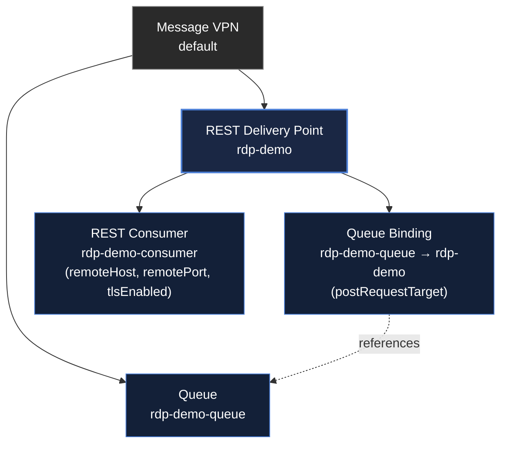

# A primer on Solace's RDP object model

A short primer on the objects a REST Delivery Point (RDP) depends on and how they relate to each
other. Useful background if you're new to Solace and working through
[`samples/resilient-delivery`](../samples/resilient-delivery/), whose `init/setup.sh` creates the
concrete objects referenced below.

## The four objects, in one sentence each

| Object | What it is |
|---|---|
| **Message VPN** | The top-level container for everything below: a virtual broker. The samples use the broker's built-in `default` VPN. |
| **Queue** | Where messages land after being published. Independent of RDP: a queue can be consumed by an app, or bound to an RDP, or both. |
| **REST Delivery Point (RDP)** | The object that turns "message arrived on a queue" into "HTTP POST fired at a URL." Owns one or more Consumers and Queue Bindings. |
| **REST Consumer** | Config *inside* an RDP naming one HTTP target: host, port, TLS, auth. An RDP can have several (for failover/load-spreading across the same logical target). |
| **Queue Binding** | Config *inside* an RDP linking one Queue to that RDP, plus the URL path to POST to. This is the object that actually says "messages from *this* queue go out." |

The **Consumer** answers *where* (host:port); the **Queue Binding** answers *which queue, and
what path*. Neither is a running service; both are configuration records the broker reads to
decide what HTTP call to make.

## Containment hierarchy: what's under what

Note the **Queue** and the **RDP** are siblings under the VPN: a Queue doesn't "belong" to an
RDP. It's the **Queue Binding**, living inside the RDP, that creates the link. This is why in the
UI you configure the queue itself (access type, quota, permissions) on the Queue's own page, but
you configure *its relationship to RDP delivery* (the POST path) on the RDP's page instead.

## See also

- [`samples/resilient-delivery`](../samples/resilient-delivery/): the concrete objects this
  primer describes, created by that sample's `init/setup.sh`.
- [`architecture.md`](architecture.md): where RDP fits in the bigger picture, alongside the
  bridge.
- [Solace: Managing REST Delivery Points Using the Event Broker CLI](https://docs.solace.com/Services/Managing-RDPs.htm):
  official reference for RDP configuration, the SEMP API, and Broker Manager UI navigation.
