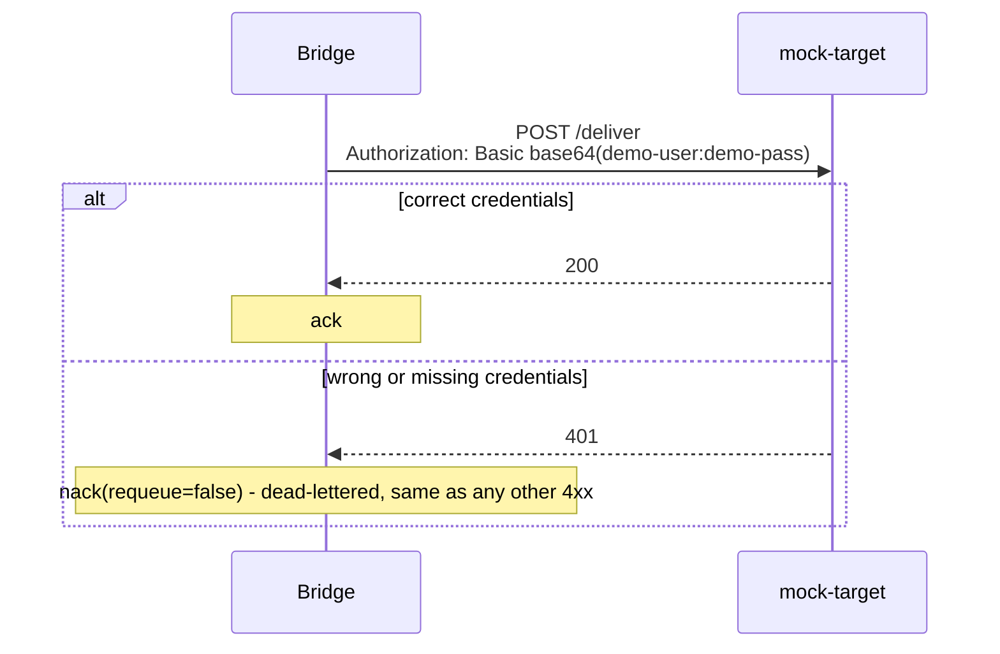

# Basic auth

## The scenario

A target requires credentials before it'll accept a delivery. A Solace REST Delivery Point (RDP)
already supports HTTP Basic auth directly on the REST consumer; what it doesn't give you is
application-level visibility into what happens when credentials are wrong, or combining that
auth with the retry/circuit-breaker/logging behavior the other samples demonstrate.

## What the bridge adds over RDP

| | Solace RDP | This bridge |
|---|---|---|
| Auth mechanism | HTTP Basic built in (also client-cert, header, OAuth2, and more) | HTTP Basic, configured per target |
| Wrong credentials | Same retry as any other failure by default; configurable since 10.12 to mark specific codes as a rejection | Recognized as a permanent rejection out of the box, no extra config; dead-lettered immediately |

Full comparison: [`../../docs/problem-and-solution.md`](../../docs/problem-and-solution.md).

## How it works here



The bridge's `http:Client` attaches the `Authorization` header itself once `targetUsername`/
`targetPassword` are set; the credentials never touch application logic beyond configuration. A
401 needs no special handling: it's already a 4xx, so the same response-aware branching that
handles a bad payload handles a rejected credential, with no extra code. See
[`../../docs/architecture.md`](../../docs/architecture.md) for that branching in full.

## Setup

```bash
cd samples/basic-auth
docker compose up -d --build
./init/setup.sh
```

`docker-config.toml` ships with the correct demo credentials (`demo-user`/`demo-pass`) already
configured, so delivery succeeds out of the box.

## Try it

**Correct credentials:**

```bash
docker exec solace-broker curl -s -X POST -H "Content-Type: application/json" \
  -H "Solace-Message-ID: W-1" -d '{"workerId":"W-1","eventType":"HIRE"}' \
  http://localhost:9000/QUEUE/bridge-demo-queue

docker compose logs -f bridge mock-target
```

Expect a normal `received -> forwarding to target -> delivered -> acked` sequence, and
`mock-target`'s log confirming valid credentials.

**Wrong credentials:**

```bash
# edit docker-config.toml: set targetPassword to anything else
docker compose restart bridge

docker exec solace-broker curl -s -X POST -H "Content-Type: application/json" \
  -H "Solace-DMQ-Eligible: true" -H "Solace-Message-ID: W-2" \
  -d '{"workerId":"W-2","eventType":"HIRE"}' \
  http://localhost:9000/QUEUE/bridge-demo-queue

curl -s -u admin:admin http://localhost:8080/SEMP/v2/monitor/msgVpns/default/queues/bridge-demo-dmq \
  | python3 -c "import json,sys; print(json.load(sys.stdin)['data']['spooledMsgCount'])"
```

Expect `mock-target` to log a 401, the bridge to log `delivery rejected ... routing to DMQ` (the
same 4xx branch a bad payload takes), and `bridge-demo-dmq`'s `spooledMsgCount` to increment by
one. The `Solace-DMQ-Eligible: true` header is required for a rejected message to actually land
in the dead message queue rather than being silently discarded.

Revert `targetPassword` back to `demo-pass` and restart to return to the working state.

## Metrics

This sample's `docker-config.toml` ships the Prometheus metrics config too, commented out.
Uncomment it and `docker compose restart bridge` to see delivery outcomes as counters at
`:9797/metrics`; see [`../../bridge/README.md`](../../bridge/README.md) for what they measure.

## Tear down

```bash
docker compose down --remove-orphans
```

Only run one sample's stack at a time; every sample uses the same container names and ports.
