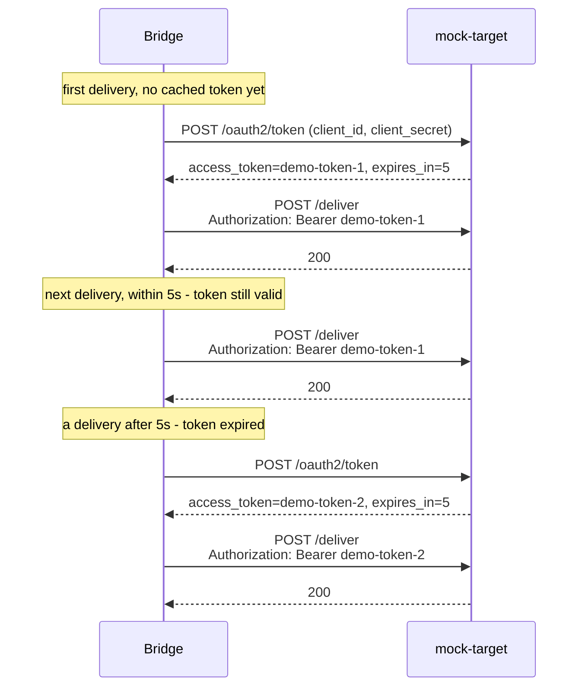

# OAuth2 client-credentials

## The scenario

A target requires an OAuth2 access token, acquired via the client-credentials grant, refreshed
as it expires. A Solace REST Delivery Point (RDP) has no first-class support for this flow at
all: there's nowhere to configure a token endpoint, nowhere for a refresh cycle to live.

## What the bridge adds over RDP

| | Solace RDP | This bridge |
|---|---|---|
| OAuth2 support | None | Full client-credentials grant: fetch, cache, transparent refresh |
| Token refresh | N/A | Automatic, on expiry, with zero visible change to delivery behavior |

Full comparison: [`../../docs/problem-and-solution.md`](../../docs/problem-and-solution.md).

## How it works here



Once `targetOAuth2TokenUrl`/`ClientId`/`ClientSecret` are set, the bridge's `http:Client` handles
this entire flow itself: fetching a token, attaching it as a `Bearer` token on every request,
caching it, and transparently fetching a new one once the cached token's own `expires_in` has
elapsed. Nothing in the bridge's own code tracks token state. See
[`../../bridge/README.md`](../../bridge/README.md) for a real limitation worth knowing before
relying on this: a *misconfigured* client secret fails differently than a wrong Basic password
does (see below).

## Setup

```bash
cd samples/oauth2-client-credentials
docker compose up -d --build
./init/setup.sh
```

## Try it

**Token acquisition and caching:**

```bash
docker exec solace-broker curl -s -X POST -H "Content-Type: application/json" \
  -H "Solace-Message-ID: W-1" -d '{"workerId":"W-1","eventType":"HIRE"}' \
  http://localhost:9000/QUEUE/bridge-demo-queue

docker compose logs -f bridge mock-target
```

Expect `mock-target` to log `issuing token token="demo-token-N"` just before the delivery lands,
then a normal `delivered -> acked` sequence. Publish a second message right away (well inside the
5-second token expiry) and it reuses the *same* token, with no second call to `/oauth2/token`.

**Transparent refresh** (wait past the expiry, then publish again):

```bash
sleep 6

docker exec solace-broker curl -s -X POST -H "Content-Type: application/json" \
  -H "Solace-Message-ID: W-2" -d '{"workerId":"W-2","eventType":"HIRE"}' \
  http://localhost:9000/QUEUE/bridge-demo-queue
```

A *new* token is issued and used automatically, with no code on the bridge side reacting to the
expiry; the `http:Client` handles the whole cycle internally.

**A real limitation to know about**: a wrong OAuth2 client secret fails very differently than a
wrong Basic password does. Edit `docker-config.toml`'s `targetOAuth2ClientSecret` to anything
else and restart:

```bash
docker compose restart bridge
docker compose ps bridge                            # STATUS keeps flipping to "Restarting"
docker inspect oauth2-client-credentials-bridge --format='{{.RestartCount}}'   # climbing on every check
```

The bridge crash-loops instead of just failing deliveries. `http:Client` fetches a token
*eagerly*, during construction, so a 401 from the token endpoint fails client construction
itself, which fails the whole module's startup, taking **both routes** down, not just the
misconfigured one. A wrong Basic password (see [`../basic-auth`](../basic-auth/)) only ever fails
the deliveries that use it, since attaching a Basic header needs no network call first. Revert
`targetOAuth2ClientSecret` back to `demo-secret` and restart to recover.

## Metrics

This sample's `docker-config.toml` ships the Prometheus metrics config too, commented out.
Uncomment it and `docker compose restart bridge` to see delivery outcomes as counters at
`:9797/metrics`; see [`../../bridge/README.md`](../../bridge/README.md) for what they measure.

## Tear down

```bash
docker compose down --remove-orphans
```

Only run one sample's stack at a time; every sample uses the same container names and ports.
