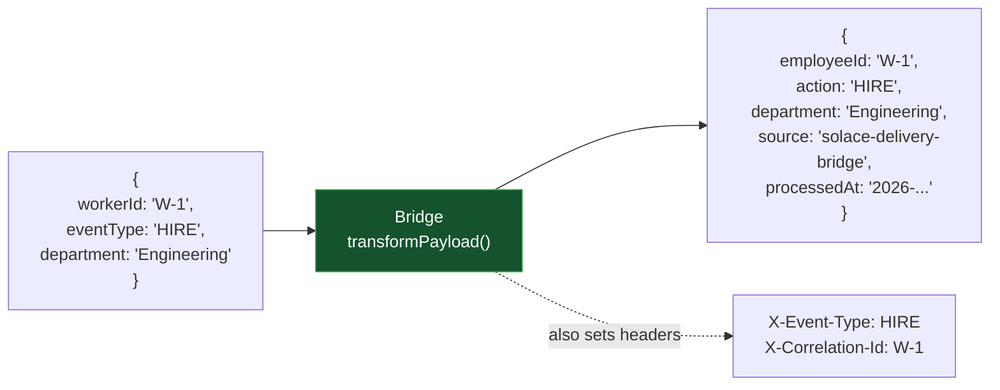

# Payload transformation

## The scenario

A Solace REST Delivery Point (RDP) delivers whatever's on the queue, verbatim, with no
transformation, enrichment, or header mapping. If the downstream system expects different field
names, or needs metadata the source message never carried, RDP can't help; that has to happen
somewhere else, or not at all.

## What the bridge adds over RDP

| | Solace RDP | This bridge |
|---|---|---|
| Field renaming | Not possible | Renames fields before delivery |
| Enrichment | Not possible | Adds metadata the source message didn't carry |
| Header mapping | Not possible | Promotes payload fields to request headers |

Full comparison: [`../../docs/problem-and-solution.md`](../../docs/problem-and-solution.md).

## How it works here

The bridge applies this sample's `docker-config.toml`-driven transformation to every message
before delivering it:



- `workerId` → `employeeId` and `eventType` → `action` (field renaming: a real downstream system
  typically speaks a different field-naming convention than the source).
- `source` and `processedAt` are added (enrichment: metadata the source message never carried).
- `action` and the message ID are also promoted to `X-Event-Type`/`X-Correlation-Id` headers.
- Anything else in the original payload (like `department` above) passes through untouched.

This mapping is entirely config-driven (`transformFieldRenames`, `transformStaticFields`,
`transformTimestampField`, `transformHeaderFields` in this sample's `docker-config.toml`); adapting
it to a different payload shape means editing that config and restarting the bridge, no code
change or rebuild. See [`../../bridge/README.md`](../../bridge/README.md)'s Payload transformation
section for the full reference, and [`../../docs/architecture.md`](../../docs/architecture.md) for
where this step sits in the overall delivery flow.

> This sample provisions two bridge queues (`bridge-demo-queue` and `bridge-demo-queue-2`) even
> though it only uses one; the bridge always runs two routes, and route 2 is just pointed at the
> same target as route 1 here. See [`multi-target-routing`](../multi-target-routing/) for when
> that second route actually does something different.

## Setup

```bash
cd samples/payload-transformation
docker compose up -d --build
./init/setup.sh
```

## Try it

```bash
docker exec solace-broker curl -s -X POST -H "Content-Type: application/json" \
  -H "Solace-Message-ID: W-1" \
  -d '{"workerId":"W-1","eventType":"HIRE","department":"Engineering"}' \
  http://localhost:9000/QUEUE/bridge-demo-queue

docker compose logs -f mock-target
```

Expect a log line showing the *transformed* body arriving: `employeeId`/`action` instead of
`workerId`/`eventType`, plus `source`/`processedAt` added, and the `X-Event-Type`/
`X-Correlation-Id` headers alongside it, not the original payload passed through unchanged.

A payload that isn't a JSON object fails transformation and never reaches the target at all;
see [`../resilient-delivery`](../resilient-delivery/) for that path (a permanent rejection,
dead-lettered immediately).

**Try changing the mapping**: edit `transformFieldRenames` in `docker-config.toml` (e.g. add
`department = "team"`), `docker compose restart bridge`, then republish the same message - the new
mapping applies immediately, no rebuild.

## Metrics

This sample's `docker-config.toml` ships the Prometheus metrics config too, commented out.
Uncomment it and `docker compose restart bridge` to see delivery outcomes as counters at
`:9797/metrics`; see [`../../bridge/README.md`](../../bridge/README.md) for what they measure.

## Tear down

```bash
docker compose down --remove-orphans
```

Only run one sample's stack at a time; every sample uses the same container names and ports.
