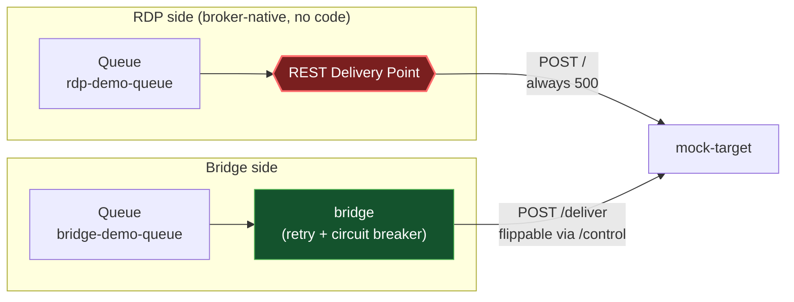

# Resilient delivery

## The scenario

A downstream target starts failing or goes down. A Solace REST Delivery Point (RDP) has no
circuit breaker and no meaningful retry policy: it keeps hammering the same failing target at a
fixed rate, forever, with no backoff. This sample runs a real RDP and the bridge side by side
against the same kind of failure, so the contrast is something you can watch happen, not just
read about.

## What the bridge adds over RDP

| | Solace RDP | This bridge |
|---|---|---|
| On a 5xx / timeout | Retries forever at a fixed rate | Retries a bounded number of times with growing backoff, then dead-letters |
| On sustained failure | No circuit breaker; keeps hammering the target | Circuit breaker trips: fast-fails without calling the target at all, until a trial call decides it's healthy again |
| On a 4xx | Same coarse handling as any other failure | Recognized as a permanent rejection: dead-lettered immediately, no retry wasted on it |
| Diagnosing a failure | Broker-level logs only | Structured logs: message ID, target, whether it was redelivered |

Full comparison: [`../../docs/problem-and-solution.md`](../../docs/problem-and-solution.md).

## How it works here



Both queues point at the same `mock-target` service, but at different resources: RDP always hits
`/` (hardcoded to always return 500; there's nothing to make that adaptive, since the point is
what RDP *can't* do), and the bridge hits `/deliver`, whose health you can flip live via a
`/control` API. See [`../../docs/architecture.md`](../../docs/architecture.md) for the bridge's
own delivery sequence in detail, and
[`../../docs/solace-rdp-primer.md`](../../docs/solace-rdp-primer.md) if you're new to Solace's
RDP object model (Queue, RDP, Consumer, Queue Binding).

## Setup

```bash
cd samples/resilient-delivery
docker compose up -d --build
./init/setup.sh
```

This starts the broker, `mock-target`, and the `bridge` (built from the shared
[`../../bridge`](../../bridge/) folder), then provisions the RDP and both queues. The bridge may
restart once or twice right after startup: it's waiting for `setup.sh` to provision its queue,
and `restart: on-failure` retries rather than requiring a specific startup order.

## Try it

#### RDP hammering with no backoff:

```bash
docker exec solace-broker curl -s -X POST -d "test payload" -H "Content-Type: text/plain" \
  http://localhost:9000/QUEUE/rdp-demo-queue

docker compose logs -f mock-target   # hammered with POST / and 500 responses, no pause between them
```

#### The bridge succeeding, then failing, then recovering:

1. baseline - succeeds
```bash
docker exec solace-broker curl -s -X POST -H "Content-Type: application/json" \
  -H "Solace-Message-ID: W-1" -d '{"workerId":"W-1","eventType":"HIRE"}' \
  http://localhost:9000/QUEUE/bridge-demo-queue

docker compose logs -f bridge   # received -> forwarding to target -> delivered -> acked
```

2. flip the target unhealthy, then publish a few messages in a row
- expect: a couple of retried failures, then ballerina/http logs
"CircuitBreaker failure threshold exceeded. 
- Circuit tripped from CLOSE to OPEN state." -
every delivery after that fast-fails ("circuit open, fast-failing ... requeueing") without a
single call reaching mock-target
```bash
curl -s -X POST -H "Content-Type: application/json" -d '{"statusCode": 503}' http://localhost:8081/control

for i in 1 2 3 4; do
  docker exec solace-broker curl -s -X POST -H "Content-Type: application/json" \
    -H "Solace-Message-ID: W-fail-$i" -d "{\"workerId\":\"W-fail-$i\",\"eventType\":\"HIRE\"}" \
    http://localhost:9000/QUEUE/bridge-demo-queue
done

docker compose logs -f bridge
```

3. flip it back healthy and wait for the circuit's resetTime (20s) to elapse
```bash
curl -s -X POST -H "Content-Type: application/json" -d '{}' http://localhost:8081/control
sleep 25

docker compose logs -f bridge
# expect: "CircuitBreaker trial run was successful. Circuit switched from HALF_OPEN to CLOSE
# state." followed by every message still queued delivering and acking cleanly
# Wait for ~25 seconds
```

**A bad payload (permanent rejection, no retry):**

```bash
docker exec solace-broker curl -s -X POST -H "Content-Type: application/json" \
  -H "Solace-DMQ-Eligible: true" -H "Solace-Message-ID: W-bad" \
  -d 'not json' http://localhost:9000/QUEUE/bridge-demo-queue

curl -s -u admin:admin http://localhost:8080/SEMP/v2/monitor/msgVpns/default/queues/bridge-demo-dmq \
  | python3 -c "import json,sys; print(json.load(sys.stdin)['data']['spooledMsgCount'])"
# Expect: incremental value for evey run.
```

The `Solace-DMQ-Eligible: true` header is required here: Solace's REST messaging inbound port
doesn't mark published messages DMQ-eligible by default, so without it a permanent rejection is
silently discarded instead of landing in the dead message queue.

## Metrics

This sample's `docker-config.toml` ships the Prometheus metrics config too, commented out.
Uncomment it and `docker compose restart bridge` to see delivery outcomes as counters at
`:9797/metrics`; see [`../../bridge/README.md`](../../bridge/README.md) for what they measure.

## Tear down

```bash
docker compose down --remove-orphans
```

Only run one sample's stack at a time; every sample uses the same container names and ports.
